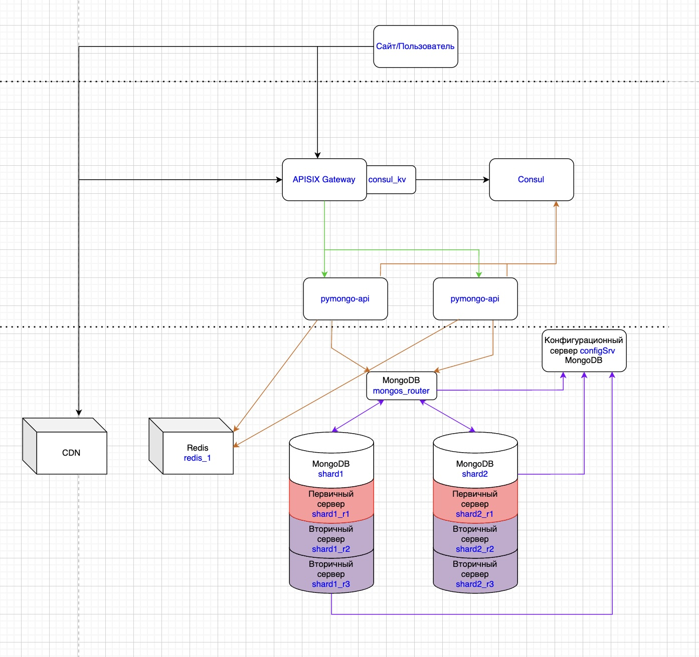

# pymongo-api

## Схема приложения
```
откройте файл schema.drawio в корне проекта
```


Все схемы расположены в папке schemas


## Как запустить

Запускаем mongodb и приложение

```shell
docker compose up -d
```

Инициализируем шардирование в MongoDB

Конфигурация: 1 роутер, 1 сервер конфигурации и 2 шарда

Чтобы всё полноценно заработало, нужно выполнить ещё ряд команд после запуска.
P.S. такие же скрипты как в уроке.
```shell
 scripts/mongo-init.sh
```

[//]: # (Заполняем mongodb данными)

[//]: # ()
[//]: # (```shell)

[//]: # (./scripts/mongo-init.sh)

[//]: # (```)

## Как проверить

### Если вы запускаете проект на локальной машине

Откройте в браузере http://localhost:8080

### Если вы запускаете проект на предоставленной виртуальной машине

Узнать белый ip виртуальной машины

```shell
curl --silent http://ifconfig.me
```

Откройте в браузере http://<ip виртуальной машины>:8080

## Доступные эндпоинты

Список доступных эндпоинтов, swagger http://<ip виртуальной машины>:8080/docs

## Полная статистическая информация
Скрипт получение количества из MongoDB, реплики/шарды, времени выполнения с/без Redis /<collection_name>/users:

```shell
scripts/mongo-count.sh
```

## Добавление данных
```shell
scripts/mongo-add-data.sh
```